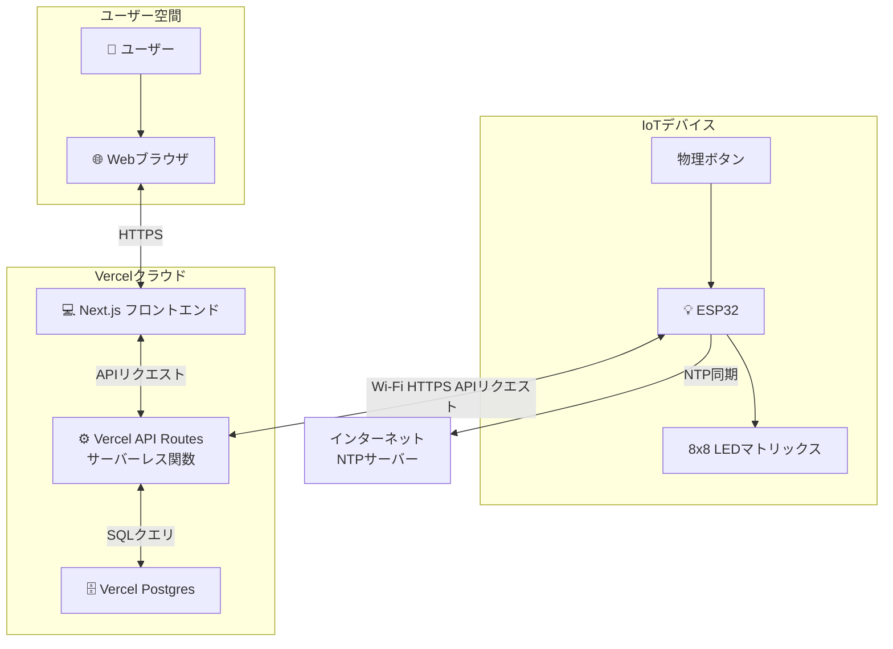
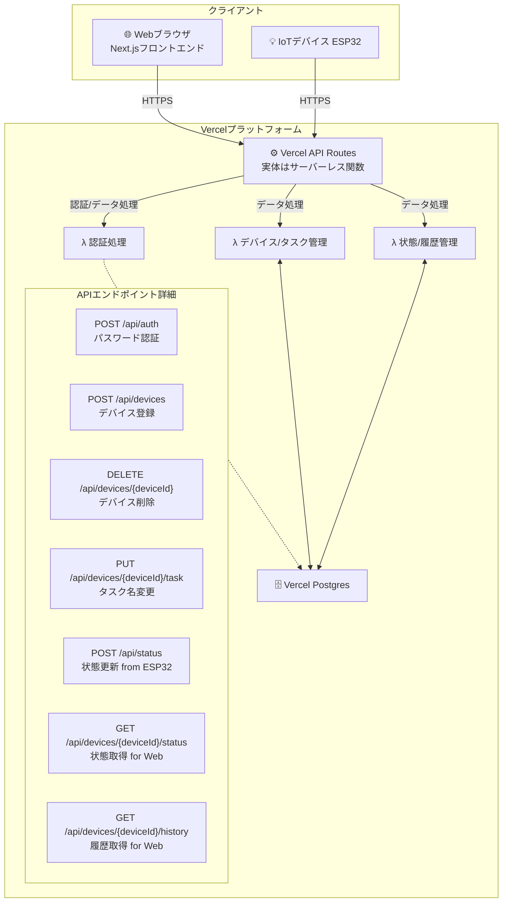

# IoTタスク管理デバイス 設計ドキュメント

## 1. プロジェクト概要

本プロジェクトは、家庭内での日々のタスク（例: メダカの餌やり、ペットの薬やりなど）の実施状況を管理・共有するためのIoTデバイスおよびWebアプリケーションを開発することを目的とします。手作り感のあるデバイスと、シンプルで使いやすいWebインターフェースを通じて、タスクのやり忘れや二重作業を防ぎます。

### 1.1. 主要機能

**IoTデバイス:**
* タスクの「済」「未」状態をLEDマトリックスに表示。
* 物理ボタンによる「済」「未」状態の切り替え。
* 毎日午前0時に自動的に全タスクを「未」にリセット。
* 現在の状態をサーバーに送信。

**Webアプリケーション:**
* 現在のタスク状態をリアルタイム（またはそれに近い形）で表示。
* 過去のタスク実施履歴をカレンダー形式などで表示。また、当日の履歴は別で表示。
* ユーザーがタスク名を自由に変更可能。
* ユーザーが新しいIoTデバイスを登録し、タスクを割り当て可能。
* デバイスの削除機能。
* アプリケーションパスワードによる簡易認証。

## 2. システム構成

本システムは、IoTデバイス、Webアプリケーション（フロントエンド）、バックエンドサービス、データベースから構成されます。

### 2.1. 全体システム構成図

### 2.2. バックエンド構成図 (Vercel API Routes + Vercel Postgres)

## 3. 主要コンポーネントと機能詳細

### 3.1. IoTデバイス (ESP32)

**ハードウェア:**
* マイクロコントローラー: ESP32
* ディスプレイ: MAX7219駆動 8x8 LEDマトリックスモジュール (1個)
* 入力: タクトスイッチ (1個)

**機能:**
* **LED表示:** 現在のタスク状態（「済」アイコン、「未」アイコン）をLEDマトリックスに表示。
* **状態切り替え:** 物理ボタン押下で「済」⇔「未」をトグル。
* **状態送信:** 状態変更時に、自身のdeviceIdと現在の状態 (status)、タイムスタンプをバックエンドAPI (/api/status) へHTTPS POSTリクエストで送信。
* **0時リセット:** NTPサーバーと時刻同期し、毎日午前0時に内部状態を「未」にリセットし、サーバーにもその旨を通知（またはサーバー側で0時を判断してリセット処理を促す）。
* **デバイスID:** 初回起動時にUUIDを生成またはMACアドレスを利用し、不揮発メモリに保存。このIDをdeviceIdとして使用。

### 3.2. Webアプリケーション (フロントエンド - Next.js)

**機能:**
* **アプリケーションパスワード認証:** 初回アクセス時にパスワード入力を求め、認証する。認証状態はセッション等で保持。
* **デバイス登録:** ユーザーがESP32から確認したdeviceIdと初期タスク名を入力し、バックエンドAPI (/api/devices) を通じてデバイスを登録。
* **状態表示:** 登録されたデバイスの現在のタスク名と「済」「未」状態をバックエンドAPI (/api/devices/{deviceId}/status) から取得し表示。
* **履歴表示:** 特定デバイスの過去のタスク実施履歴をバックエンドAPI (/api/devices/{deviceId}/history) から取得し、カレンダー形式などで表示。履歴は常に最新のタスク名で表示される。
* **タスク名変更:** ユーザーが特定のデバイスのタスク名を変更。バックエンドAPI (/api/devices/{deviceId}/task) を呼び出す。タスク名変更時に「履歴を保持する」か「履歴をリセット（削除）する」かを選択できるオプションを提供する。
* **デバイス削除:** 登録されているデバイスを削除。バックエンドAPI (/api/devices/{deviceId}) を呼び出す。削除前にユーザーに確認を求める。

### 3.3. バックエンド (Vercel API Routes + Vercel Postgres)

**Vercel API Routes (サーバーレス関数):**
* フロントエンドおよびIoTデバイスからのリクエストを処理するAPIエンドポイント群。
* 認証、デバイス管理、タスク管理、状態管理、履歴管理などのロジックを実装。

**Vercel Postgres (データベース):**
* **Devices テーブル (または Tasks テーブル):**
    * `deviceId` (TEXT, PRIMARY KEY): デバイスのUUIDであり、タスクの識別子。
    * `taskName` (TEXT NOT NULL): ユーザーが設定・変更するタスク名。
    * `userId` (TEXT NOT NULL): (今回は1ユーザーなので固定値または識別可能な値)
    * `createdAt` (TIMESTAMP WITH TIME ZONE, DEFAULT CURRENT_TIMESTAMP)
    * `updatedAt` (TIMESTAMP WITH TIME ZONE, DEFAULT CURRENT_TIMESTAMP)
    * (任意) `currentStatus` (TEXT): 最新の状態（「済」/「未」）。
    * (任意) `lastStatusUpdateAt` (TIMESTAMP WITH TIME ZONE): 最新状態の更新日時。
* **TaskStatusLog テーブル:**
    * `logId` (SERIAL, PRIMARY KEY または UUID)
    * `deviceId` (TEXT NOT NULL, REFERENCES Devices(deviceId) ON DELETE CASCADE): どのデバイス（タスク）の履歴か。
    * `timestamp` (TIMESTAMP WITH TIME ZONE NOT NULL): 履歴のタイムスタンプ。
    * `status` (TEXT NOT NULL): 「済」または「未」。

**APIエンドポイント例 (詳細は別途API仕様書で定義):**
* `POST /api/auth`: アプリケーションパスワード認証。
* `POST /api/devices`: 新規デバイス登録（deviceId, taskName を含む）。
* `DELETE /api/devices/{deviceId}`: デバイス削除（関連するタスク情報と履歴も削除）。
* `PUT /api/devices/{deviceId}/task`: タスク名変更（taskName、履歴リセットオプションを含む）。
* `POST /api/status`: IoTデバイスからの状態更新（deviceId, status, timestamp を含む）。
* `GET /api/devices/{deviceId}/status`: 特定デバイスの現在のタスク名と状態を取得。
* `GET /api/devices/{deviceId}/history`: 特定デバイスの履歴を取得（期間指定など可能に）。

**ロジック:**
* **デバイス削除時:** Devicesテーブルから該当レコードを削除。TaskStatusLogテーブルの関連レコードもCASCADE制約により自動削除されるか、明示的に削除。
* **タスク名変更時の履歴リセット:** ユーザーが選択した場合、該当deviceIdのTaskStatusLogレコードを全て削除。

## 4. 技術スタック

* **フロントエンド:** Next.js (プログラミング言語: TypeScript), Tailwind CSS
* **バックエンド (Vercel API Routes):** TypeScript (Node.jsランタイム)
* **データベース:** Vercel Postgres
* **IoTデバイス (ESP32):** Arduino (C++)

## 5. 開発フロー

### フェーズ1: フロントエンドプロトタイプ作成
* 主要画面のUI/UXデザイン（モックアップ作成）。
* モックデータを使用してフロントエンドの基本的な画面遷移やコンポーネントを実装。
* アプリケーションパスワード認証画面の実装。
* デバイス登録画面、タスク名変更画面、状態表示、履歴表示画面の骨子作成。

### フェーズ2: バックエンド実装
* Vercel Postgresにテーブルスキーマを定義。
* Vercel API Routesで各APIエンドポイントとロジックを実装 (認証、デバイス管理、タスク管理、状態・履歴管理)。
* フロントエンドプロトタイプとAPIを接続し、基本的なデータ連携を確認。

### フェーズ3: IoTデバイス実装
* LEDマトリックス表示制御。
* ボタン入力処理。
* NTP時刻同期。
* APIへの状態送信機能実装。
* デバイスID管理。

### フェーズ4: 統合とテスト
* 全コンポーネントを統合し、エンドツーエンドのテストを実施。
* ユーザーシナリオに基づいたテスト。
* バグ修正と調整。

### フェーズ5: デプロイと運用準備
* Vercelにフロントエンドとバックエンドをデプロイ。
* （個人利用のため、簡易的な運用手順確認）

## 6. ユーザー認証

* 単一ユーザーによる個人利用を想定。
* Webアプリケーションの初回アクセス時に、事前に設定された固定の「アプリケーションパスワード」を要求。
* 認証成功後は、セッションストレージ等に認証済みフラグを保持し、再アクセス時のパスワード入力を省略。

## 7. デバイス登録・管理フロー

1. **デバイスID取得:** ユーザーはESP32デバイスのセットアップ時（例: シリアルモニター経由）に一意のデバイスID（UUIDなど）を確認する。
2. **デバイス登録:** Webアプリケーションのデバイス登録画面で、取得したデバイスIDと初期タスク名を入力して登録する。
3. **タスク割り当て:** デバイス登録と同時にタスクが割り当てられる (1デバイス=1タスク)。タスク名は後から変更可能。
4. **デバイス削除:** Webアプリケーションからデバイスを削除可能。削除時には、関連するタスク情報および全ての履歴データも削除される（ユーザーに確認を求める）。

## 8. その他考慮事項

* **エラーハンドリング:** 各コンポーネントで適切なエラーハンドリングとユーザーへのフィードバックを行う。
* **ESP32の設定情報:** Wi-Fi認証情報やAPIエンドポイントURLなどは、開発者（ユーザー自身）がESP32のソースコード等で設定する（本アプリケーションサービスのスコープ外）。

このドキュメントは、プロジェクトの進行に合わせて適宜更新されるものとします。
